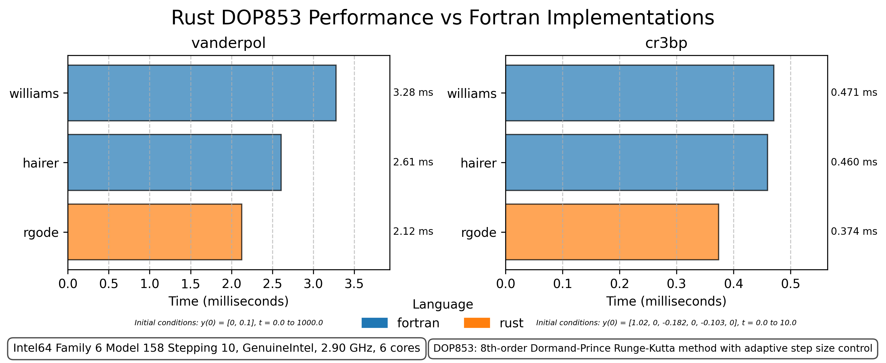

# Ordinary Differential Equations (ODE)

The `ode` module provides tools for solving ordinary differential equations (ODEs), specifically focusing on initial value problems (IVPs).

## Table of Contents

- [Solvers](#solvers)
- [Defining a ODE](#defining-a-system)
- [Solving an Initial Value Problem (IVP)](#solving-an-initial-value-problem-ivp)
- [Examples](#examples)
- [Notation](#notation)
- [Benchmarks](#benchmarks)

## Solvers

The module includes a set of solvers for solving ODEs. The solver algorithmic core and coefficients are implemented as structs implementing the `Solver` trait. The solver's settings can then be configured before being used in the `ivp.solve(&mut solver)` method which acts as the controller for the solver.

### Fixed Step Size

| Solver | Description |
|--------|-------------|
| `Euler` | Euler's method (1st order Runge-Kutta) |
| `Midpoint` | Midpoint method (2nd order Runge-Kutta) |
| `Heuns` | Heun's method (2nd order Runge-Kutta) |
| `Ralston` | Ralston's method (2nd order Runge-Kutta) |
| `RK4` | Classical 4th order Runge-Kutta method |
| `ThreeEights` | 3/8 Rule 4th order Runge-Kutta method |
| `APCF4` | Adams-Predictor-Corrector 4th order fixed step-size method |

### Adaptive Step Size

| Solver | Description |
|--------|-------------|
| `RKF` | Runge-Kutta-Fehlberg 4(5) adaptive method |
| `CashKarp` | Cash-Karp 4(5) adaptive method |
| `DOPRI5` | Dormand-Prince 5(4) adaptive method |
| `DOP853` | Explicit Runge-Kutta method of order 8 |
| `APCV4` | Adams-Predictor-Corrector 4th order variable step-size method |

All solvers except `DOP853`, which has its own higher-order internal interpolation method, uses cubic Hermite interpolation method for calculating desired `t-out` values and finding `eventAction::Terminate` points.

## Defining a ODE

The `ODE` trait defines the differential equation `dydt = f(t, y)` for the solver. The differential equation is used to solve the ordinary differential equation. The trait also includes a `event` function to interrupt the solver when a condition is met or an event occurs.

### ODE Trait
* `diff` - Differential Equation `dydt = f(t, y)` in the form `f(t, &y, &mut dydt)`.
* `event` - Optional event function to interrupt the solver when a condition is met by returning `EventAction::Terminate(reason: EventData)`. The `event` function by default returns `EventAction::Continue` and thus is ignored. Note that `EventData` is by default a `String` but can be replaced with anything implementing `Clone + Debug`.

### Solout Trait
* `solout` - function to choose which points to save in the solution. This is useful when you want to save only points that meet certain criteria. Common implementations are included in the `solout` module. The `IVP` trait implements methods to use them easily without direct interaction as well e.g. `even`, `dense`, and `t_eval`.

### Implementation
```rust
// Includes required elements and common solvers.
// Less common solvers are in the `solvers` module
use differential_equations::ode::*; 
use nalgebra::{SVector, vector};

struct LogisticGrowth {
    k: f64,
    m: f64,
}

impl ODE<f64, 1, 1> for LogisticGrowth {
    fn diff(&self, _t: f64, y: &SVector<f64, 1>, dydt: &mut SVector<f64, 1>) {
        dydt[0] = self.k * y[0] * (1.0 - y[0] / self.m);
    }

    fn event(&self, _t: f64, y: &SVector<f64, 1>, _dydt: &SVector<f64, 1>) -> EventAction {
        if y[0] > 0.9 * self.m {
            EventAction::Terminate("Reached 90% of carrying capacity".to_string())
        } else {
            EventAction::Continue
        }
    }
}
```

Note that for clarity, the `ODE` is defined with generics `<T, R, C>` where `T` is the float type and `R, C` is the dimension of the system of ordinary differential equations. By default the generics are `f64, 1, 1` and thus can be omitted if the system is a single ODE with a `f64` type.

## Solving an Initial Value Problem (IVP)

The `IVP` trait is used to solve the system using the solver. The trait includes methods to set the initial conditions, solve the system, and get the solution. The `solve` method returns a `Result<Solution, SolverStatus>` where `Solution` is a struct containing the solution including fields with outputted t, y, and the solver status, and `SolverStatus` is returned with the error if it occurs. In addition, statistics including steps, evals, rejected steps, accepted steps, and the solve time are included as fields in the `Solution` struct.

```rust
fn main() {
    let mut solver = DOP853::new().rtol(1e-12).atol(1e-12);
    let y0 = vector![1.0];
    let t0 = 0.0;
    let tf = 10.0;
    let ode = LogisticGrowth { k: 1.0, m: 10.0 };
    let logistic_growth_ivp = IVP::new(ode, t0, tf, y0);
    match logistic_growth_ivp
        .even(1.0)          // uses EvenSolout to save with dt of 1.0
        .solve(&mut solver) // Solve the system and return the solution
    {
        Ok(solution) => {
            // Check if the solver stopped due to the event command
            if let SolverStatus::Interrupted(ref reason) = solution.status {
                // State the reason why the solver stopped
                println!("Solver stopped: {}", reason);
            }

            // Print the solution
            println!("Solution:");
            for (t, y) in solution.iter() {
                println!("({:.4}, {:.4})", t, y[0]);
            }

            // Print the statistics
            println!("Function evaluations: {}", solution.evals);
            println!("Steps: {}", solution.steps);
            println!("Rejected Steps: {}", solution.rejected_steps);
            println!("Accepted Steps: {}", solution.accepted_steps);
        }
        Err(e) => panic!("Error: {:?}", e),
    };
}
```

### Output

```sh
Solver stopped: Reached 90% of carrying capacity
Solution:
(0.0000, 1.0000)
(1.0000, 2.3197)
(2.0000, 4.5085)
(3.0000, 6.9057)
(4.0000, 8.5849)
(4.3944, 9.0000)
Function evaluations: 359
Steps: 25
Rejected Steps: 4        
Accepted Steps: 21
```

## Examples

For more examples, see the `examples` directory. The examples demonstrate different systems, solvers, and output methods for different use cases.

| Example | Description & Demonstrated Features |
|---|---|
| [Exponential Growth](../../examples/ode/01_exponential_growth/main.rs) | Solves a simple exponential growth equation using the `DOP853` solver. Demonstrates basic usage of `IVP` and `ODE` traits. Manually prints results from `Solution` struct fields. |
| [Harmonic Oscillator](../../examples/ode/02_harmonic_oscillator/main.rs) | Simulates a harmonic oscillator system using `RK4` method. Uses a condensed setup to demonstrate chaining to solve without intermediate variables. Uses `last` method on solution to conveniently get results and print. |
| [Logistic Growth](../../examples/ode/03_logistic_growth/main.rs) | Models logistic growth with a carrying capacity. Demonstrates the use of the `event` function to stop the solver based on a condition. In addition shows the use of `even` output for `IVP` setup and `iter` method on the solution for output. |
| [SIR Model](../../examples/ode/04_sir_model/main.rs) | Simulates the SIR model for infectious diseases. Uses the `APCV4` solver to solve the system. Uses custom event termination enum. |
| [Damped Pendulum](../../examples/ode/05_damped_pendulum/main.rs) | Simulates a simple pendulum using the `RKF` solver. Shows the use of `ivp.t_out` to define points to be saved e.g. `t_out = [1.0, 3.0, 7.5, 10.0]` |
| [Integration](../../examples/ode/06_integration/main.rs) | Demonstrates the differences between `even`, `dense`, `t_out`, and the default solout methods for a simple differential equation with an easily found analytical solution. |
| [Cr3bp](../../examples/ode/07_cr3bp/main.rs) | Simulates the Circular Restricted Three-Body Problem (CR3BP) using the `DOP853` solver. Uses the `hyperplane_crossing` method to log when the spacecraft crosses a 3D plane. |
| [Damped Oscillator](../../examples/ode/08_damped_oscillator/main.rs) | Demonstrates the use of the `crossing` method to use the CrossingSolout to log instances where a crossing occurs. In this case, the example saves points where the position is at zero. |
| [Matrix ODE](../../examples/ode/09_matrix_ode/main.rs) | Solves a system of ODEs using a matrix system. Demonstrates how to define a system of equations using matrices. |
| [Custom Solout](../../examples/ode/10_custom_solout/main.rs) | Demonstrates how to create a custom `Solout` implementation to save points based on a custom condition. In addition inside the Solout struct additional calculations are stored and then accessed via `Solution.solout.(fields)` |

## Benchmarks

Included is a submodule [differential-equations-benchmarks](../differential-equations-benchmarks) which contains benchmarks comparing the speed of the `DOP853` solver implementation in `differential-equations` against implementations in other programming languages including Fortran.

A sample result via `differential-equations-benchmarks` is shown below:

[](../differential-equations-benchmarks "Averaged over 100 runs for each problem per solver implementation")

Testing has shown that the `differential-equations` Rust implementation is about 10% faster than the Fortran implementations above. Take the result with a grain of salt as more testing by other users is needed to confirm the results.

More information can be found in the [differential-equations-benchmarks](../differential-equations-benchmarks) directory's [README](../differential-equations-benchmarks/README.md).

## Notation

Typical ODE libraries either use `x` or `t` for the independent variable and `y` for the dependent variable. This library uses the following notation:
- `t` - The independent variable, typically time often `x` in other ode libraries.
- `y` - The dependent variable, instead of `x` to avoid confusion with an independent variable in other notations.
- `dydt` - The derivative of `y` with respect to `t`.
- `k` - The coefficients of the solver, typically a derivative such as in the Runge-Kutta methods.

Any future solvers added to the library should follow this notation to maintain consistency.
